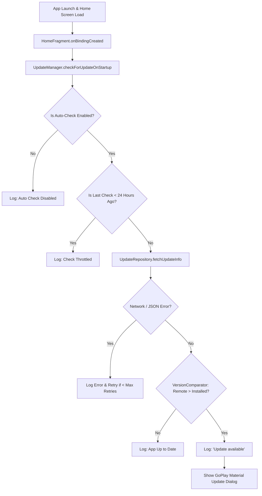
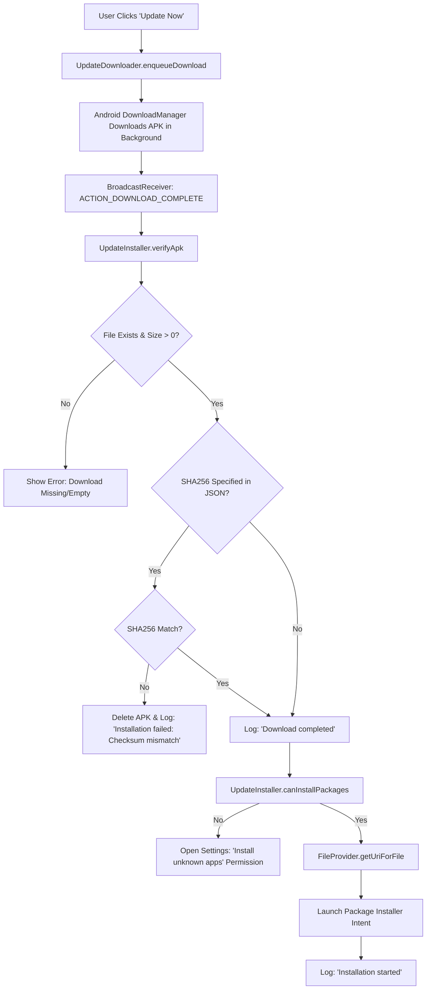

# Walkthrough - Automatic In-App Update System for GoPlay

A production-ready, lifecycle-aware in-app update system has been implemented for the **GoPlay** Android application. It automatically checks remote update endpoints (`https://pub-e9a64ec2e4424ee6b04d9dac6a883b3b.r2.dev/update.json`), manages background downloads via Android `DownloadManager`, validates SHA256 checksums, handles install permissions, and launches package installation using `FileProvider`.

---

## 1. List of Created & Modified Files

### New Classes
- [UpdateConfig.kt](file:///d:/Poject/CloudStream/cloudstream/app/src/main/java/com/lagradost/cloudstream3/updates/UpdateConfig.kt)
  Centralized parameters: Default update endpoint URL (`https://pub-e9a64ec2e4424ee6b04d9dac6a883b3b.r2.dev/update.json`), network timeouts, retry count (`3`), 24-hour check interval, default preferences, and logging tag (`GoPlayUpdate`).
- [UpdatePreferences.kt](file:///d:/Poject/CloudStream/cloudstream/app/src/main/java/com/lagradost/cloudstream3/updates/UpdatePreferences.kt)
  SharedPreferences wrapper for auto-check toggle, Wi-Fi only download setting, beta notifications, update endpoint URL, and last check timestamp tracking.
- [VersionComparator.kt](file:///d:/Poject/CloudStream/cloudstream/app/src/main/java/com/lagradost/cloudstream3/updates/VersionComparator.kt)
  Integer `versionCode` and semantic version comparison utility.
- [UpdateRepository.kt](file:///d:/Poject/CloudStream/cloudstream/app/src/main/java/com/lagradost/cloudstream3/updates/UpdateRepository.kt)
  Data model `UpdateResponse` matching remote JSON format (`versionCode`, `versionName`, `apkUrl`, `releaseNotes`, `mandatory`, `apkSize`, `sha256`) and HTTP fetch client with error handling for 404, 500, timeouts, and network offline states.
- [UpdateDownloader.kt](file:///d:/Poject/CloudStream/cloudstream/app/src/main/java/com/lagradost/cloudstream3/updates/UpdateDownloader.kt)
  Android `DownloadManager` integration with background download support, notification progress (`VISIBILITY_VISIBLE_NOTIFY_COMPLETED`), and Wi-Fi restriction enforcement.
- [UpdateInstaller.kt](file:///d:/Poject/CloudStream/cloudstream/app/src/main/java/com/lagradost/cloudstream3/updates/UpdateInstaller.kt)
  File validation, SHA256 checksum calculation, `REQUEST_INSTALL_PACKAGES` permission verification (`canRequestPackageInstalls()`), `FileProvider` URI generation, and Package Installer intent launcher (`ACTION_VIEW`).
- [UpdateManager.kt](file:///d:/Poject/CloudStream/cloudstream/app/src/main/java/com/lagradost/cloudstream3/updates/UpdateManager.kt)
  Facade / Coordinator managing startup check throttling, manual update triggers, GoPlay Material AlertDialog rendering, download completion broadcast receivers, user toast notifications, and analytics logging.

### Modified Files
- [settings_updates.xml](file:///d:/Poject/CloudStream/cloudstream/app/src/main/res/xml/settings_updates.xml)
  Added App Updates preferences section: Auto check for updates, Download over Wi-Fi only, Notify about beta versions, Check for updates now, Current version, and Last checked timestamp.
- [SettingsUpdates.kt](file:///d:/Poject/CloudStream/cloudstream/app/src/main/java/com/lagradost/cloudstream3/ui/settings/SettingsUpdates.kt)
  Bound Settings UI preferences to `UpdateManager.checkForUpdateManual()` and `UpdatePreferences`.
- [HomeFragment.kt](file:///d:/Poject/CloudStream/cloudstream/app/src/main/java/com/lagradost/cloudstream3/ui/home/HomeFragment.kt)
  Invokes non-blocking background update check (`UpdateManager.checkForUpdateOnStartup()`) after the Home screen loads.
- [strings.xml](file:///d:/Poject/CloudStream/cloudstream/app/src/main/res/values/strings.xml)
  Added string resources for GoPlay update preferences.

---

## 2. System Flow Diagrams

### Startup & Update Check Flow



### Download, Verification & Installation Flow



---

## 3. Testing Instructions

### A. Testing Remote Endpoint & Dialog
1. Host a test `update.json` on your server/CDN:
   ```json
   {
     "versionCode": 9999,
     "versionName": "3.0.0",
     "apkUrl": "https://pub-e9a64ec2e4424ee6b04d9dac6a883b3b.r2.dev/goplay.apk",
     "releaseNotes": [
       "Major release 3.0.0",
       "New video player enhancements",
       "Faster extension loading"
     ],
     "mandatory": false,
     "apkSize": 48200000,
     "sha256": null
   }
   ```
2. Open GoPlay -> Navigate to **Settings → App Updates**.
3. Tap **Check for updates now**.
4. Observe the **New Version Available** dialog displaying version `v3.0.0`, release notes, formatted APK size (`45.97 MB`), and `Update Now` / `Later` buttons.

### B. Testing Download & Installation
1. Tap **Update Now**.
2. Verify notification progress bar appears in system status bar via Android `DownloadManager`.
3. Upon completion, verify package installer intent triggers automatically.
